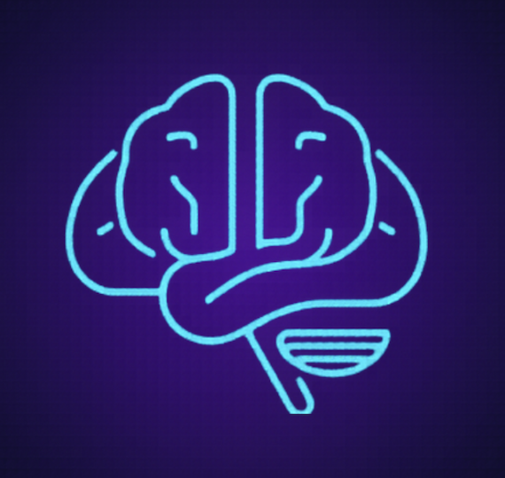
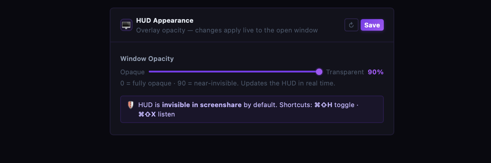
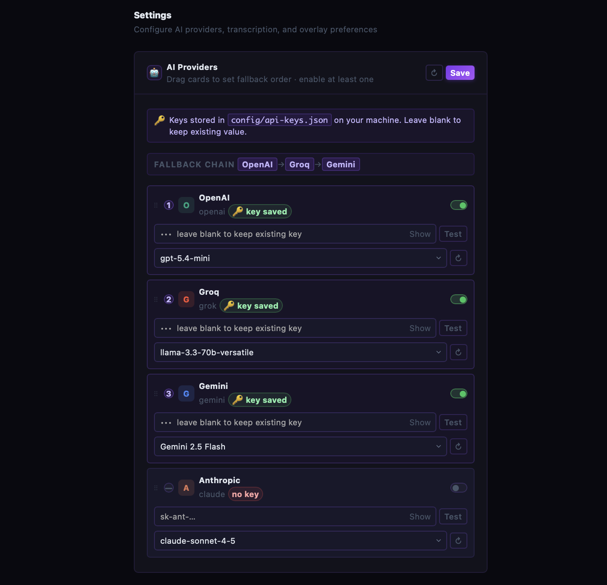
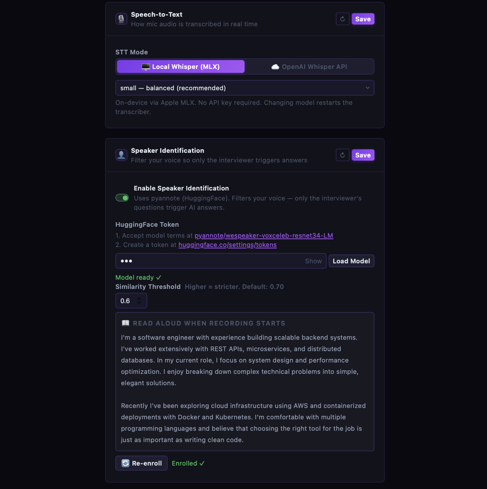

<div align="center">



# SolveWatch AI

**Real-time AI interview assistant — invisible to your interviewer**

Live transcription → instant AI answers → stealth HUD overlay

[](https://github.com/parmeet10/solveWatchAi/actions/workflows/ci.yml)
[](LICENSE)
[](https://github.com/parmeet10/solveWatchAi/releases)
[](https://github.com/parmeet10/solveWatchAi)
[](https://github.com/parmeet10/solveWatchAi)
[](https://nodejs.org)
[](https://python.org)

</div>

---

## Demo

<div align="center">
  <a href="https://youtu.be/GE15expmqXs">
    
  </a>

  *Click to watch the demo*
</div>

---

## What is SolveWatch?

SolveWatch listens to your interview through your microphone, transcribes questions in real time using on-device Whisper, and streams AI answers into a floating HUD overlay — completely invisible to Zoom, Google Meet, Teams, and every other screen-capture tool.

No browser extension. No cloud audio. Runs on your machine.

---

## Screenshots

<div align="center">



*The HUD overlay — always on top, invisible in screenshare*

</div>

<br/>

<div align="center">


*Settings page — configure providers, fallback chain, and models*
</div>

<br/>

<div align="center">


*On-device Whisper STT with speaker diarization*
</div>

---

## Features

| | Feature | Details |
|---|---------|---------|
| 🎤 | **Flexible STT** | Three modes: **Local Whisper** (MLX on Apple Silicon, openai-whisper on Windows — fully offline), **OpenAI Whisper API** (cloud, no local model), or **Deepgram Cloud** (nova-2, ~300ms latency, $0.0059/min with $200 free credit). Switch in settings, no restart needed. |
| 👁️ | **Invisible overlay** | `setContentProtection(true)` — same OS API used by banking apps. Excluded from Zoom, Meet, Teams, Loom, OBS, and all screen recording tools. Works for full-screen share, not just window share. |
| ⚡ | **Sub-second answers** | First token in ~200 ms with Groq. Answers stream token-by-token into the HUD while the model is still generating. |
| 🔁 | **Multi-provider fallback** | Configure a cascade: OpenAI → Groq → Gemini → Claude → Ollama. If one fails or rate-limits, the next kicks in automatically. |
| 🧠 | **Conversation memory** | Remembers the last 3–5 Q&A pairs. Follow-up questions like *"what are its trade-offs?"* work correctly. |
| 📸 | **Screenshot analysis** | Monitors a folder for new screenshots, runs OCR (Tesseract) + AI, and shows the answer in the HUD. Great for coding problems shared on screen. |
| 👤 | **Speaker identification** | Local-mode only: SpeechBrain ECAPA-TDNN filters your voice so only the interviewer's questions trigger AI answers. Enroll a 30s sample once. Deepgram mode uses built-in diarization instead. |
| 📊 | **Grafana observability** | Optional OpenTelemetry export to Grafana Cloud — AI latency, token spend, STT pipeline health, host metrics. Import `docs/grafana-dashboard.json` to get the pre-built dashboard. |
| 🆓 | **Free & open source** | MIT license. The only outbound calls are to your own API keys. |

---

## Quick Start

### 1 — First-time setup

```bash
git clone https://github.com/parmeet10/solveWatchAi.git
cd solveWatchAi
./start.sh --setup
```

This installs Homebrew, Node.js, Python, Ollama, and all dependencies — then starts the app.

### 2 — Add your API keys

Open the settings page and paste in at least one key:

```
http://localhost:4000/settings
```

| Provider | Get a key |
|----------|-----------|
| Groq *(fastest — recommended first)* | [console.groq.com/keys](https://console.groq.com/keys) |
| OpenAI | [platform.openai.com/api-keys](https://platform.openai.com/api-keys) |
| Gemini | [aistudio.google.com/app/apikey](https://aistudio.google.com/app/apikey) |
| Claude | [console.anthropic.com/settings/api-keys](https://console.anthropic.com/settings/api-keys) |
| Deepgram *(optional — cloud STT)* | [console.deepgram.com](https://console.deepgram.com) |

Keys are saved to `.env` in the project root — hot-reloaded, no restart needed.

### 3 — Start the app

```bash
./start.sh
```

| Shortcut | Action |
|----------|--------|
| `⌘ Shift H` | Toggle HUD on/off |
| `⌘ Shift X` | Toggle listening on/off |

Press `Ctrl+C` to stop all services.

---

## Start flags

```bash
./start.sh                  # normal start
./start.sh --setup          # install deps + start
./start.sh --setup-only     # install deps only
./start.sh --newlogs        # clear logs then start
./start.sh --debug          # verbose Python transcriber output
./start.sh --newlogs --debug  # flags can be combined
```

---

## Architecture

Three services run together, managed by `start.sh`:

```
Microphone
  │
  ▼
┌─────────────────────────────────────────┐
│  Python Transcriber                     │
│                                         │
│  Local mode (default):                  │
│    VAD → rolling buffer                 │  Whisper MLX (Apple Silicon) or
│    LocalAgreement-2 streaming decoder   │  openai-whisper (Windows/CPU)
│    → stt_partial every 300ms            │  Fully offline, no API key
│    → stt_final on 700ms silence         │
│                                         │
│  Deepgram mode (DEEPGRAM_ENABLED=true): │
│    DeepgramListener streams audio       │  nova-2 cloud STT, ~300ms latency
│    → stt_partial (live words)           │  Built-in speaker diarization
│    → stt_final on utterance end         │
└──────────────────┬──────────────────────┘
                   │ Socket.IO
                   ▼
┌─────────────────────────────┐
│  Node.js Backend            │  Express + Socket.IO
│  Assembles prompt           │  OpenAI → Groq → Gemini → Claude → Ollama
│  Streams answer tokens ─────┼──► Electron HUD
│  Session memory             │
└─────────────────────────────┘
             │
             ▼
┌─────────────────────────────┐
│  Electron HUD               │  Frameless, always-on-top overlay
│  380×460px                  │  setContentProtection(true)
│  Invisible in screenshare   │  Renders tokens as they stream in
└─────────────────────────────┘
```

**Screenshot flow** runs in parallel: `uploads/` folder → Sharp preprocessing → Tesseract OCR → same AI pipeline → HUD.

---

## How the overlay stays invisible

`setContentProtection(true)` is an OS-level API — the same one used by banking apps and DRM video players.

- **macOS:** maps to `NSWindow.sharingType = NSWindowSharingNone`
- **Windows:** maps to `SetWindowDisplayAffinity(WDA_EXCLUDEFROMCAPTURE)`

These flags tell the OS compositor to exclude the window from **all** capture streams — window capture and full-screen capture alike. The capture tool receives a frame that was never composed with the overlay. Your interviewer sees only your desktop.

Confirmed invisible on: Zoom · Google Meet · Microsoft Teams · Loom · OBS Studio · macOS Screenshot · Windows Snipping Tool · Discord Go Live

---

## vs Cluely / Parakeet

| | **SolveWatch** | Cluely | Parakeet |
|---|---|---|---|
| Price | **Free (MIT)** | $29–49/mo | $20–40/mo |
| API cost | **Your keys only** | Included (their cloud) | Included (their cloud) |
| Open source | ✅ | ❌ | ❌ |
| Offline STT | ✅ | ❌ | ❌ |
| Custom AI provider | ✅ | ❌ | ❌ |
| Response latency | **~200–400 ms** | ~600–1200 ms | ~500–900 ms |
| macOS | ✅ | ✅ | ✅ |
| Windows | ✅ | ✅ | — |

---

## Troubleshooting

**HUD doesn't appear**
Press `⌘ Shift H`. Check the terminal for Electron startup errors.

**No transcription / mic not working**
Go to `System Settings → Privacy → Microphone` and allow Terminal (macOS). Try switching to the `small` Whisper model.

**AI not responding**
Open settings, check at least one provider is enabled, and use the **Test** button to verify the key.

**Screenshot analysis not working**
Set the screenshots folder in settings and confirm it matches where macOS saves screenshots (`System Settings → Screenshots → Save to`).

**Transcriber not starting**
Run `./start.sh --setup` to recreate the Python venv.

**Ollama missing**
Run `./start.sh --setup` — it pulls `llama3.2:1b` automatically.

---

## Configuration

All config lives in `.env` at the project root — hot-reloaded by the settings page, no restart needed. Copy from `.env.example` on first setup.

```bash
# AI providers (at least one required)
OPENAI_API_KEY=sk-...
GROQ_API_KEY=gsk_...
GEMINI_API_KEY=AIza...
ANTHROPIC_API_KEY=sk-ant-...

# Provider order and which are active
PROVIDER_ORDER=openai,grok,gemini,claude
PROVIDER_ENABLED=openai,grok,gemini,claude

# Models (optional — defaults shown)
MODEL_OPENAI=gpt-4o-mini
MODEL_GROK=llama-3.3-70b-versatile
MODEL_GEMINI=gemini-2.5-flash
MODEL_CLAUDE=claude-sonnet-4-5
OLLAMA_MODEL=llama3.2:1b

# STT — local Whisper model size (tiny/base/small/medium)
STT_MODEL=small

# Deepgram Cloud STT (optional — set to true to use instead of local Whisper)
DEEPGRAM_ENABLED=false
DEEPGRAM_API_KEY=
DEEPGRAM_MODEL=nova-2

# Speaker identification (local Whisper mode only)
SPEAKER_ID_ENABLED=false
SPEAKER_ID_THRESHOLD=0.70

# Observability — Grafana Cloud OTLP (optional)
TELEMETRY_ENABLED=false
OTLP_ENDPOINT=https://otlp-gateway-prod-us-east-0.grafana.net/otlp
GRAFANA_INSTANCE_ID=
GRAFANA_ACCESS_TOKEN=

PORT=4000
```

Existing installs with `config/api-keys.json` are migrated automatically on the first `./start.sh` run.

---

## Roadmap

Planned features — contributions welcome:

- [x] Deepgram Cloud STT (nova-2, ~300ms latency)
- [x] Ollama local LLM fallback
- [x] Grafana Cloud observability (OTel metrics + logs)
- [x] Speaker identification (local Whisper mode)
- [ ] Linux support
- [ ] Browser extension mode (no Electron required)
- [ ] Answer history panel with copy-to-clipboard
- [ ] Custom hotkey configuration in settings UI
- [ ] Automated release builds (DMG for macOS, EXE installer for Windows)

---

## Star History

[](https://star-history.com/#parmeet10/solveWatchAi&Date)

---

## License

[MIT](./LICENSE) — free for personal and commercial use.
