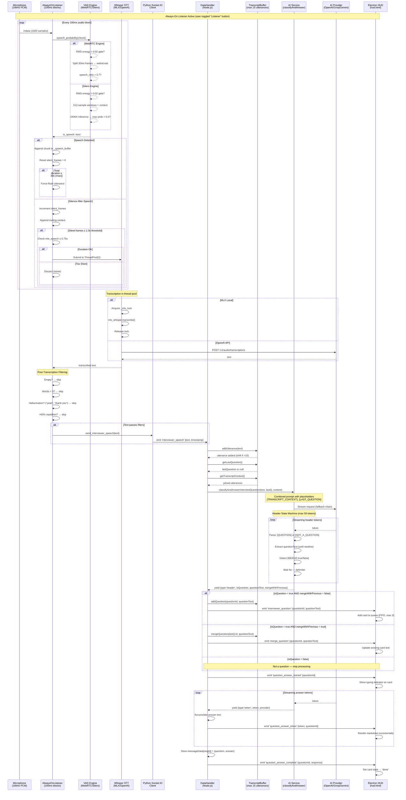
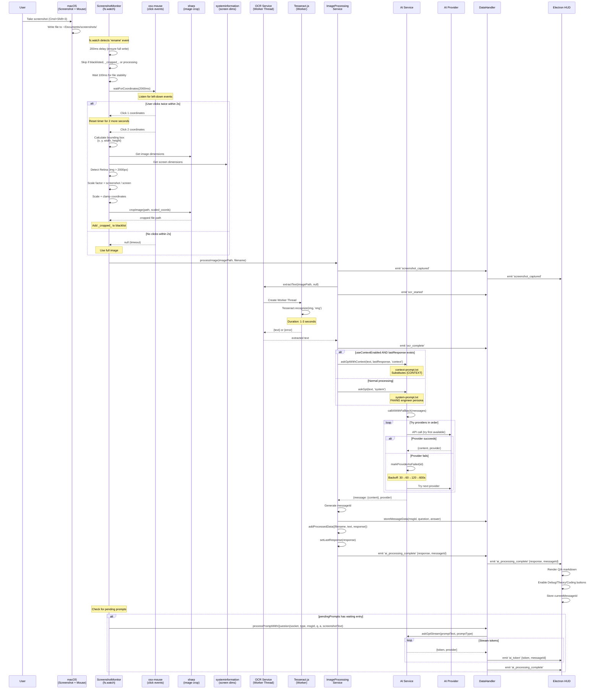
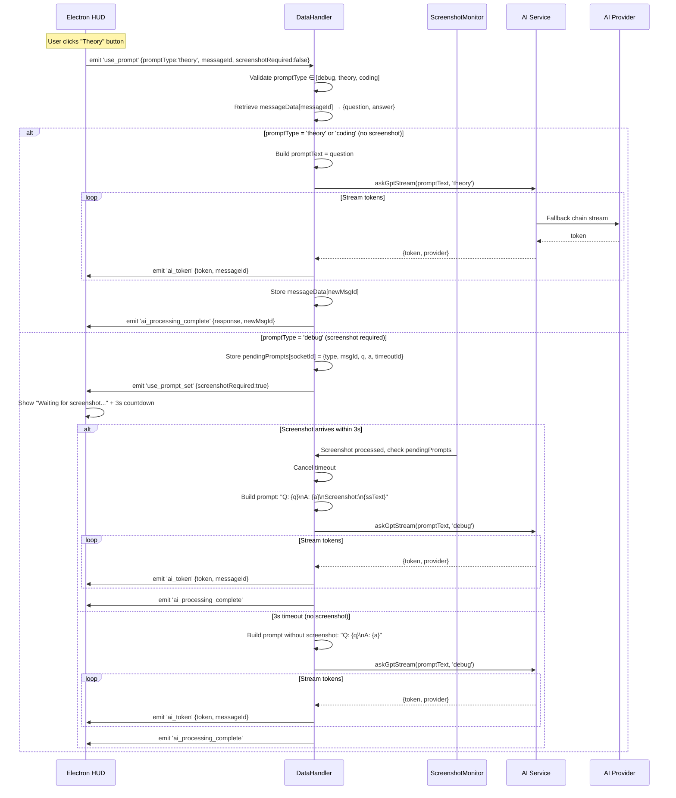
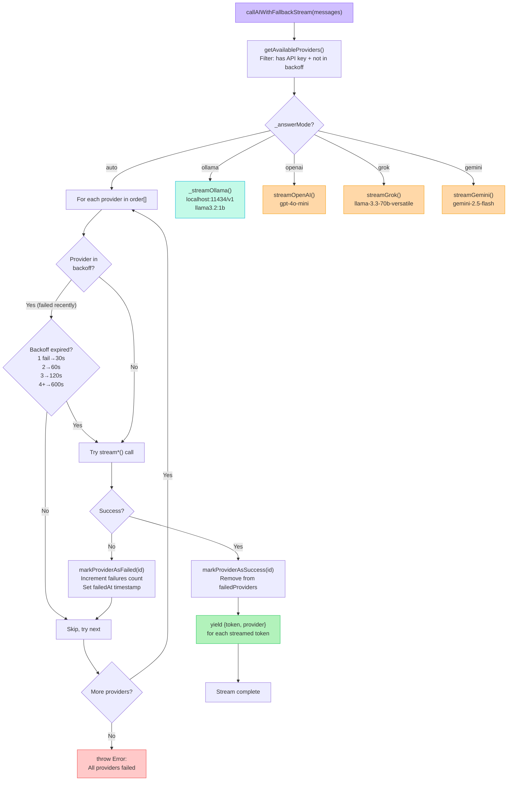
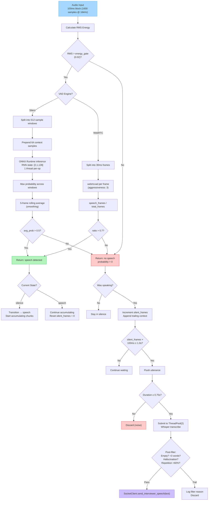
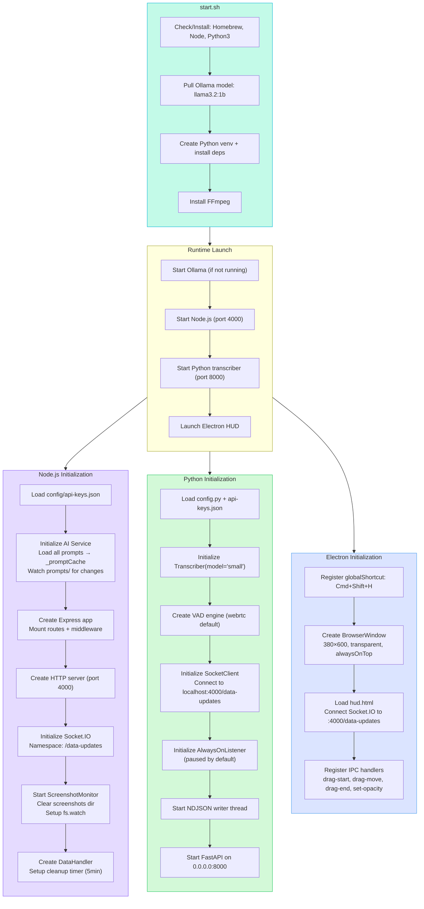

# SolveWatch AI — Low-Level Architecture Diagrams

## 1. Full System Architecture

```mermaid
graph TB
    subgraph ELECTRON["Electron Desktop (main.js)"]
        direction TB
        EW["BrowserWindow<br/>380×600, transparent<br/>alwaysOnTop: screen-saver<br/>visibleOnAllWorkspaces"]
        EP["preload.js<br/>hudAPI: startDrag, dragMove,<br/>endDrag, setOpacity"]
        EH["hud.html<br/>Socket.IO Client → /data-updates<br/>Markdown Renderer<br/>Question Card Queue (max 3)"]
        EW --> EP --> EH
        HK["Global Hotkey<br/>Cmd+Shift+H → toggleOverlay()"]
        HK --> EW
    end

    subgraph HUD_UI["HUD Interface Components"]
        direction LR
        DRAG["Drag Region<br/>Title + Status Badge + Clock"]
        QUEUE["Interview Queue<br/>Question Cards (max 3)<br/>States: idle→answering→done<br/>Typing indicator + MD render"]
        RESP["AI Response Panel<br/>Q/A split rendering<br/>Scrollable markdown"]
        ACTIONS["Action Bar<br/>Listener (yellow)<br/>Debug (red, screenshot)<br/>Theory (purple)<br/>Coding (green)"]
    end

    subgraph NODE["Node.js Backend (Port 4000)"]
        direction TB
        subgraph COMM["Communication Layer"]
            direction LR
            SIO["Socket.IO Namespace<br/>/data-updates<br/>Transport: websocket<br/>CORS: origin *"]
            EXPRESS["Express.js<br/>CORS + JSON + URLEncoded<br/>Static: /src/public<br/>GET /settings → settings.html"]
        end

        subgraph ROUTES["REST API Routes"]
            direction LR
            R1["POST /api/upload<br/>Multer: 10MB, images only<br/>Filename: upload-{ts}-{rand}.ext"]
            R2["GET /api/data<br/>→ processedData array"]
            R3["GET/POST /api/config/keys<br/>Masked keys response<br/>Merge + validate on save"]
            R4["GET/POST /api/config/full<br/>All settings + VAD params"]
            R5["GET/POST /api/context-state<br/>useContextEnabled flag"]
        end

        subgraph HANDLERS["DataHandler (Socket Event Handlers)"]
            direction TB
            DH_STATE["State:<br/>transcriptionChunks: Map(socketId→chunks)<br/>selectedPrompts: Map(socketId→type)<br/>messageData: Map(msgId→{q,a,type,socket,ts})<br/>pendingPrompts: Map(socketId→{type,msgId,timeout})<br/>transcriptBuffer: InterviewTranscriptBuffer"]

            DH_INTERVIEW["handleInterviewerSpeech(socket, {text})<br/>→ addUtterance → classifyAndAnswer<br/>→ emit question/merge/tokens"]
            DH_USEPROMPT["handleUsePrompt(socket, {promptType, msgId, ssRequired})<br/>Validate: debug|theory|coding<br/>If ssRequired: wait 3s for screenshot<br/>→ processPromptWithQuestion()"]
            DH_ANSWER["handleAnswerQuestion(socket, {questionId})<br/>→ retrieve from buffer<br/>→ answerInterviewQuestion stream"]
            DH_TRANSCRIPTION["handleTranscription → accumulate chunks<br/>handleProcessTranscription → join + stream AI"]
            DH_SETTINGS["handleSetSttModel → POST :8000/set-stt-model<br/>handleSetAnswerMode → aiService.setAnswerMode<br/>handleSetVadConfig → POST :8000/set-vad-config<br/>handleToggleAlwaysOn → POST :8000/always-on-mode<br/>handleGetSettings → fetch STT + return state<br/>handleSetHudOpacity → emit to all clients"]
            DH_PROCESS["processPromptWithQuestion()<br/>→ build prompt text<br/>→ aiService.askGptStream()<br/>→ emit ai_token per token<br/>→ store messageData<br/>→ emit ai_processing_complete"]
        end

        subgraph BUFFER["InterviewTranscriptBuffer"]
            direction LR
            BUF_STATE["_utterances: Array (max 15)<br/>_questions: Array (max 3)<br/>Each: {id, text, timestamp}"]
            BUF_METHODS["addUtterance(text) → shift if >15<br/>getTranscriptContext() → join all<br/>addQuestion(qId, text)<br/>mergeQuestion(qId, newText)<br/>getLastQuestion() → last or null"]
        end

        subgraph SERVICES["Service Layer"]
            direction TB
            subgraph AI_SVC["AI Service"]
                direction TB
                AI_STATE["Config: keys, order, enabled<br/>failedProviders: Map(id→{failedAt, failures})<br/>_promptCache: Map(type→content)<br/>_answerMode: auto|ollama|openai|grok|gemini"]

                subgraph PROVIDERS["Provider Calls"]
                    direction LR
                    P_OAI["callOpenAI()<br/>gpt-4o-mini<br/>temp:0.7 max:2048"]
                    P_GROK["callGrok()<br/>llama-3.3-70b-versatile<br/>temp:0.7 max:2048"]
                    P_GEM["callGemini()<br/>gemini-2.5-flash<br/>temp:0.7 max:2048"]
                    P_OLLAMA["_callOllamaClassifier()<br/>llama3.2:1b<br/>localhost:11434/v1"]
                end

                subgraph STREAMING["Streaming Generators"]
                    direction LR
                    S_OAI["streamOpenAI()<br/>yields tokens"]
                    S_GROK["streamGrok()<br/>yields tokens"]
                    S_GEM["streamGemini()<br/>generateContentStream()"]
                    S_OLLAMA["_streamOllama()<br/>local streaming"]
                end

                FALLBACK["callAIWithFallbackStream()<br/>Try providers in order<br/>Skip failed (in backoff)<br/>yields {token, provider}"]
                BACKOFF["Exponential Backoff:<br/>1 fail→30s, 2→60s<br/>3→120s, 4+→600s max<br/>markProviderAsFailed()<br/>markProviderAsSuccess()"]

                subgraph AI_HIGH["High-Level APIs"]
                    direction LR
                    HL1["askGptStream(text, promptType)<br/>System prompt + text"]
                    HL2["askGptTranscriptionStream()<br/>Transcription prompt"]
                    HL3["askGptWithContextStream()<br/>Context prompt + {CONTEXT}"]
                end

                subgraph AI_INTERVIEW["Interview Methods"]
                    direction TB
                    IV1["classifyAndAnswerInterviewQuestion()<br/>Combined prompt with placeholders:<br/>{TRANSCRIPT_CONTEXT}, {LAST_QUESTION}<br/>Header state machine (max 50 tokens):<br/>→ detect [QUESTION]/[NOT_A_QUESTION]<br/>→ extract questionText<br/>→ detect [MERGE:true/false]<br/>→ wait for --- delimiter<br/>yields: {type:header} then {type:token}"]
                    IV2["answerInterviewQuestion(qText, context)<br/>interview-answer prompt<br/>Route by _answerMode<br/>yields {token, provider}"]
                end
            end

            subgraph OCR_SVC["OCR Service"]
                direction LR
                OCR_MAIN["extractText(imagePath, coords)<br/>Creates Worker Thread<br/>Duration: 1-3s"]
                OCR_WORKER["ocr.worker.js<br/>Optional crop via sharp<br/>Tesseract.recognize(img, 'eng')<br/>Posts {text} or {error}"]
                OCR_MAIN --> OCR_WORKER
            end

            subgraph SS_MON["Screenshot Monitor Service"]
                direction TB
                SS_STATE["blacklistedShots: Set<br/>processingFiles: Set<br/>watcher: fs.watch"]
                SS_WATCH["setupDirectoryWatcher()<br/>fs.watch ~/Documents/screenshots/<br/>Event: rename (200ms delay)<br/>Skip: _cropped_ files, blacklisted"]
                SS_PROCESS["processScreenshot(filename)<br/>1. Skip if processing/blacklisted<br/>2. Wait 100ms for full write<br/>3. waitForCoordinates(2000ms)<br/>4. If 2 clicks → cropImage()<br/>5. processImage(path)<br/>6. Check pendingPrompts"]
                SS_COORDS["waitForCoordinates(2000ms)<br/>osx-mouse left-down events<br/>Click1 → reset timer 2s<br/>Click2 → bounding box<br/>Returns {x,y,w,h} or null"]
                SS_CROP["cropImage(path, coords)<br/>sharp: get image dimensions<br/>systeminformation: screen dims<br/>Retina detect (>2000px)<br/>Scale factor = ss/screen<br/>Clamp to bounds<br/>Output: {name}_cropped_...ext"]
            end

            subgraph IMG_SVC["Image Processing Service"]
                direction TB
                IMG_STATE["processedData: Array (max 100)<br/>lastResponse: string|null<br/>useContextEnabled: boolean<br/>dataHandlers: Array"]
                IMG_PROCESS["processImage(imagePath, filename)<br/>1. Emit: screenshot_captured<br/>2. OCR: extractText() → text<br/>3. Emit: ocr_started → ocr_complete<br/>4. If context: askGptWithContext<br/>   Else: askGpt('system')<br/>5. Store messageData[msgId]<br/>6. Emit: ai_processing_complete<br/>7. Return {text, response, context}"]
            end

            subgraph PROMPTS["Prompt Cache (prompts/)"]
                direction LR
                PR1["system-prompt.txt<br/>FAANG engineer persona"]
                PR2["transcription-prompt.txt<br/>Live interview processing"]
                PR3["interview-combined-prompt.txt<br/>Classify + Answer single-call"]
                PR4["interview-answer-prompt.txt<br/>Answer with transcript context"]
                PR5["interview-classifier-prompt.txt<br/>JSON classification output"]
                PR6["debug-prompt.txt<br/>Screenshot debug context"]
                PR7["theory-prompt.txt<br/>Theory/concept handling"]
                PR8["coding-prompt.txt<br/>Coding problem focus"]
                PR9["context-prompt.txt<br/>{CONTEXT} substitution"]
            end
        end

        subgraph MIDDLEWARE["Middleware"]
            direction LR
            MW1["upload.middleware.js<br/>Multer disk storage<br/>upload-{ts}-{rand}.ext<br/>Image filter, 10MB limit"]
            MW2["error.middleware.js<br/>MulterError handler<br/>404 notFoundHandler<br/>500 generic error"]
        end

        subgraph TTL["Message TTL Cleanup"]
            direction LR
            TTL_CFG["MESSAGE_TTL_MS: 30min<br/>CLEANUP_INTERVAL_MS: 5min<br/>Periodic: delete expired entries"]
        end
    end

    subgraph PYTHON["Python Transcriber (Port 8000)"]
        direction TB
        subgraph FASTAPI["FastAPI Server"]
            direction LR
            FA1["POST /start-recording<br/>POST /stop-recording"]
            FA2["POST /always-on-mode<br/>{enabled: bool}"]
            FA3["POST /set-stt-model<br/>{model: tiny|base|small|medium|large|whisper-1}"]
            FA4["POST /set-vad-config<br/>{engine, thresholds...}"]
            FA5["GET /health<br/>GET /settings<br/>GET /vad-metrics"]
        end

        subgraph AOL["AlwaysOnListener"]
            direction TB
            AOL_STATE["State Machine: silence ↔ speech<br/>Audio: 100ms blocks, 16kHz<br/>Block size: 1600 samples<br/>_speech_buffer: list[ndarray]<br/>_paused: bool"]
            AOL_THRESH["Thresholds:<br/>silence: 1.0s → flush<br/>min_speech: 0.75s<br/>max_utterance: 30.0s (force-flush)<br/>min_word_count: 3"]
            AOL_CALLBACK["_audio_callback(indata):<br/>1. Get 100ms chunk<br/>2. VAD: speech probability<br/>3. Smoothing (Silero: 5-frame avg)<br/>4. Record metrics<br/>5. State machine:<br/>   speech → append buffer<br/>   silence+was_speech → inc counter<br/>   silent >= threshold → flush"]
            AOL_FLUSH["Flush Process:<br/>1. Check min duration ≥ 0.75s<br/>2. Submit transcription to pool<br/>3. Reset VAD state"]
            AOL_FILTER["Post-Transcription Filter:<br/>1. Empty text → skip<br/>2. Words < 3 → skip<br/>3. Hallucination list → skip<br/>4. >60% word repetition → skip<br/>5. Repeated bigrams → skip"]
        end

        subgraph TRANSCRIBER["Transcriber"]
            direction TB
            TR_LOCAL["_transcribe_local(audio)<br/>mlx_whisper.transcribe()<br/>Models: mlx-community/whisper-{size}-mlx<br/>Thread lock: _mlx_lock<br/>GPU: Apple Silicon"]
            TR_API["_transcribe_api(audio)<br/>OpenAI Whisper API<br/>POST /v1/audio/transcriptions<br/>Model: whisper-1<br/>Format: WAV bytes"]
            TR_VALIDATE["_validate_audio():<br/>Mono conversion<br/>≥0.5s check<br/>Float32 + normalize<br/>Resample to 16kHz<br/>VAD speech check"]
        end

        subgraph VAD["VAD Engines"]
            direction LR
            subgraph WEBRTC["WebRTC VAD"]
                WR1["GMM-based (aggressiveness: 3)<br/>1. RMS energy > gate (0.02)<br/>2. Split into 30ms frames<br/>3. webrtcvad per frame<br/>4. speech_ratio > 0.7<br/>Fallback: RMS > 0.01"]
            end
            subgraph SILERO["Silero VAD"]
                SL1["DNN ONNX Runtime<br/>Model: silero_vad.onnx<br/>1. RMS energy > gate (0.02)<br/>2. 512-sample windows<br/>3. 64-sample context prepend<br/>4. RNN state [2,1,128]<br/>5. Max prob across windows<br/>Threshold: 0.5"]
            end
        end

        subgraph SOCK_CLIENT["Socket.IO Client"]
            direction TB
            SC_CONN["Connection:<br/>URL: localhost:4000<br/>Namespace: /data-updates<br/>Reconnect: 1s→2s→4s→...→30s max<br/>Background retry thread"]
            SC_EMIT["Emits:<br/>transcription {textChunk}<br/>process_transcription {}<br/>interviewer_speech {text, timestamp}"]
            SC_LISTEN["Listens:<br/>ai_processing_started<br/>ai_token → print live<br/>ai_processing_complete<br/>aiprocessing_error"]
        end

        subgraph PY_STATE["Python Global State"]
            direction LR
            PS1["recorder: AudioRecorder<br/>transcriber: Transcriber<br/>socket_client: SocketClient<br/>always_on_listener: AlwaysOnListener"]
            PS2["_audio_buffer: list + Lock<br/>_min_audio_duration: 0.5s<br/>_transcription_executor: ThreadPool(2)<br/>_transcription_queue: deque (NDJSON)"]
        end
    end

    subgraph EXTERNAL["External Services"]
        direction TB
        OPENAI_API["OpenAI API<br/>gpt-4o-mini (chat)<br/>whisper-1 (STT)"]
        GROQ_API["Groq API<br/>llama-3.3-70b-versatile"]
        GEMINI_API["Google Gemini API<br/>gemini-2.5-flash"]
        OLLAMA["Ollama (Local)<br/>localhost:11434/v1<br/>llama3.2:1b"]
    end

    subgraph CONFIG["Configuration Files"]
        direction LR
        CFG1["config/api-keys.json<br/>keys, order, enabled<br/>stt_model, answer_mode<br/>hud_opacity, vad params"]
        CFG2["transcriber/config.py<br/>SAMPLE_RATE: 16kHz<br/>WHISPER_MODEL: small<br/>RECORD_KEY: cmd+shift+x<br/>VAD_ENGINE: webrtc"]
    end

    subgraph SYSTEM["macOS System Resources"]
        direction LR
        MIC["Microphone<br/>16kHz PCM mono"]
        SSDIR["~/Documents/screenshots/<br/>fs.watch for new files"]
        MOUSE["osx-mouse<br/>left-down click events"]
        DISPLAY["systeminformation<br/>Screen dimensions<br/>Retina detection"]
    end

    %% Cross-system connections
    EH <-->|"Socket.IO WebSocket<br/>/data-updates"| SIO
    EH -->|"HTTP requests"| EXPRESS
    ACTIONS -->|"use_prompt, toggle_always_on"| SIO
    SIO -->|"ai_token, interviewer_question<br/>question_answer_token<br/>ai_processing_complete"| EH

    SIO --> DH_INTERVIEW
    SIO --> DH_USEPROMPT
    SIO --> DH_ANSWER
    SIO --> DH_TRANSCRIPTION
    SIO --> DH_SETTINGS
    EXPRESS --> ROUTES

    DH_INTERVIEW --> BUFFER
    DH_INTERVIEW --> AI_INTERVIEW
    DH_USEPROMPT --> DH_PROCESS
    DH_PROCESS --> AI_HIGH
    DH_ANSWER --> IV2
    DH_TRANSCRIPTION --> AI_HIGH

    AI_HIGH --> FALLBACK
    AI_INTERVIEW --> FALLBACK
    FALLBACK --> STREAMING
    STREAMING --> BACKOFF

    S_OAI -->|"API Stream"| OPENAI_API
    S_GROK -->|"API Stream"| GROQ_API
    S_GEM -->|"API Stream"| GEMINI_API
    S_OLLAMA -->|"Local Stream"| OLLAMA
    P_OAI --> OPENAI_API
    P_GROK --> GROQ_API
    P_GEM --> GEMINI_API
    P_OLLAMA --> OLLAMA

    SS_WATCH -->|"file detected"| SS_PROCESS
    SS_PROCESS --> SS_COORDS
    SS_PROCESS --> SS_CROP
    SS_PROCESS --> IMG_PROCESS
    IMG_PROCESS --> OCR_MAIN
    IMG_PROCESS --> AI_HIGH

    SSDIR --> SS_WATCH
    MOUSE --> SS_COORDS
    DISPLAY --> SS_CROP

    MIC --> AOL_CALLBACK
    AOL_CALLBACK --> VAD
    AOL_FLUSH --> TRANSCRIBER
    AOL_FILTER --> SC_EMIT

    SC_EMIT -->|"Socket.IO events"| SIO
    TR_LOCAL -->|"MLX GPU"| MIC
    TR_API --> OPENAI_API

    DH_SETTINGS -->|"HTTP POST"| FASTAPI

    CFG1 --> AI_STATE
    CFG1 --> AOL_THRESH
    CFG2 --> TRANSCRIBER

    classDef electron fill:#dbe4ff,stroke:#4a9eed,color:#1e1e1e
    classDef node fill:#e5dbff,stroke:#8b5cf6,color:#1e1e1e
    classDef python fill:#d3f9d8,stroke:#22c55e,color:#1e1e1e
    classDef external fill:#fff3bf,stroke:#f59e0b,color:#1e1e1e
    classDef system fill:#ffc9c9,stroke:#ef4444,color:#1e1e1e
    classDef config fill:#c3fae8,stroke:#06b6d4,color:#1e1e1e

    class EW,EP,EH,HK electron
    class SIO,EXPRESS,R1,R2,R3,R4,R5 node
    class DH_STATE,DH_INTERVIEW,DH_USEPROMPT,DH_ANSWER,DH_TRANSCRIPTION,DH_SETTINGS,DH_PROCESS node
    class BUF_STATE,BUF_METHODS node
    class AI_STATE,P_OAI,P_GROK,P_GEM,P_OLLAMA,S_OAI,S_GROK,S_GEM,S_OLLAMA,FALLBACK,BACKOFF node
    class HL1,HL2,HL3,IV1,IV2 node
    class OCR_MAIN,OCR_WORKER node
    class SS_STATE,SS_WATCH,SS_PROCESS,SS_COORDS,SS_CROP node
    class IMG_STATE,IMG_PROCESS node
    class MW1,MW2,TTL_CFG node
    class FA1,FA2,FA3,FA4,FA5 python
    class AOL_STATE,AOL_THRESH,AOL_CALLBACK,AOL_FLUSH,AOL_FILTER python
    class TR_LOCAL,TR_API,TR_VALIDATE python
    class WR1,SL1 python
    class SC_CONN,SC_EMIT,SC_LISTEN python
    class PS1,PS2 python
    class OPENAI_API,GROQ_API,GEMINI_API,OLLAMA external
    class CFG1,CFG2 config
    class MIC,SSDIR,MOUSE,DISPLAY system
```

## 2. Interview Mode — Detailed Sequence Diagram



## 3. Screenshot Processing — Detailed Sequence Diagram



## 4. Re-Process Flow (use_prompt) — Debug/Theory/Coding



## 5. AI Provider Fallback Chain



## 6. Socket.IO Event Map

```mermaid
flowchart LR
    subgraph HUD_TO_NODE["HUD → Node.js"]
        direction TB
        E1["use_prompt<br/>{promptType, messageId, screenshotRequired}"]
        E2["toggle_always_on_mode<br/>{enabled}"]
        E3["set_stt_model<br/>{model}"]
        E4["set_answer_mode<br/>{mode}"]
        E5["get_settings<br/>{}"]
        E6["set_hud_opacity<br/>{value}"]
        E7["set_vad_config<br/>{engine, thresholds...}"]
        E8["answer_question<br/>{questionId}"]
    end

    subgraph NODE_TO_HUD["Node.js → HUD"]
        direction TB
        F1["connected<br/>{socketId, timestamp}"]
        F2["ai_token<br/>{token, messageId}<br/>(to requesting socket only)"]
        F3["ai_processing_complete<br/>{response, message, messageId}"]
        F4["aiprocessing_error<br/>{error, message}"]
        F5["interviewer_question<br/>{questionId, questionText}"]
        F6["merge_question<br/>{questionId, questionText}"]
        F7["question_answer_started<br/>{questionId}"]
        F8["question_answer_token<br/>{token, questionId}"]
        F9["question_answer_complete<br/>{questionId, response}"]
        F10["screenshot_captured / ocr_started / ocr_complete"]
        F11["use_prompt_set<br/>{promptType, messageId, screenshotRequired}"]
        F12["hud_opacity_updated<br/>{value}"]
        F13["settings_state<br/>{sttModel, answerMode, enabledProviders}"]
        F14["stt_model_updated / vad_config_updated"]
    end

    subgraph PY_TO_NODE["Python → Node.js"]
        direction TB
        G1["transcription<br/>{textChunk}"]
        G2["process_transcription<br/>{}"]
        G3["interviewer_speech<br/>{text, timestamp}"]
    end

    subgraph NODE_TO_PY["Node.js → Python (HTTP)"]
        direction TB
        H1["POST :8000/always-on-mode<br/>{enabled}"]
        H2["POST :8000/set-stt-model<br/>{model}"]
        H3["POST :8000/set-vad-config<br/>{config}"]
        H4["GET :8000/settings"]
    end

    style HUD_TO_NODE fill:#dbe4ff,stroke:#4a9eed
    style NODE_TO_HUD fill:#e5dbff,stroke:#8b5cf6
    style PY_TO_NODE fill:#d3f9d8,stroke:#22c55e
    style NODE_TO_PY fill:#fff3bf,stroke:#f59e0b
```



## 7. VAD Processing Pipeline



## 8. Configuration & Startup Flow


